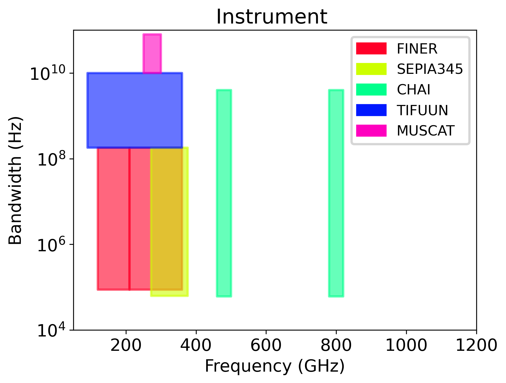

Instrument Overview
===================

At the current stage of development, we are a long way from knowing any precise details of the instrument suite available on AtLAST. Nevertheless, we expect to see a variety of spectrometers and continuum cameras. As our default instrument, we use a generic heterodyne with a receiver temperature of :math:`5h\nu/k`. 

To go beyond this, in order to approximate the future instrumentation available on AtLAST, we have worked with instrument teams that are designing the latest instruments for single-dish sub-mm and mm telescopes. This is in no way to suggest that these particular instruments will be available on AtLAST, but by representing these in our calculator, we aim to provide examples of what could achieved by using the most cutting-edge instruments on a telescope with a 50m primary mirror.

.. csv-table::
    :header: "Name", "Telescope", "Project page"

    "CHAI", CCAT, https://www.ccatobservatory.org/chai/
    "FINER", LMT, https://finerreceiver.github.io/
    "MUSCAT", LMT, https://muscat-docs.astro.cf.ac.uk/
    "SEPIA", APEX, https://www.apex-telescope.org/ns/observing/the-telescope/instruments/sepia/sepia345/
    "TIFUUN", ASTE,

Frequency and bandwidth ranges
^^^^^^^^^^^^^^^^^^^^^^^^^^^^^^

Each instrument has a specified range of frequencies and bandwidths as shown in the table and plot below. The calculator will select the appropriate instrument based on the user input frequency and bandwidth, with the default heterodyne being selected for any regions of parameter space not covered by the following instruments. For cases where two or more instruments overlap in parameter space, an arbitrary instrument will be selected. This can then be changed by the user as described in the :ref:`user guide <section_instrument_selection>`.

.. csv-table::
    :header: "Name", "Freq_min (GHz)", "Freq_max (GHz)", "Band_min (Hz)", "Band_max (Hz)"

    "FINER", 120, 210, 8.80E+04, 1.80E+08
    "FINER", 210, 360, 8.80E+04, 1.80E+08
    "SEPIA", 272, 376, 6.25E+04, 1.80E+08
    "CHAI", 460, 500, 6.10E+04, 4.00E+09
    "CHAI", 780, 820, 6.10E+04, 4.00E+09
    "TIFUUN", 90, 360, 1.80E+08, 1.00E+10
    "MUSCAT", 250, 300, 1.00E+10, 8.00E+10

System temperatures
^^^^^^^^^^^^^^^^^^^
More information on the instruments and a detailed explanation of the equations used to calculate their system temperatures can be found in the following pages.

.. toctree::
    :maxdepth: 2
    
    default_tsys
    chai_tsys
    finer_tsys
    muscat_tsys
    sepia_tsys
    tifuun_tsys