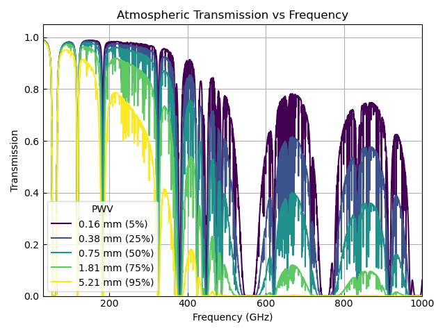

Weather Calculations
====================

Atmospheric Model Grids
-----------------------

A grid of atmospheric temperature and opacity were calculated using `*am* models <https://zenodo.org/records/13748403>`__ for the Atacama Plateau (specifically using the configuration files for the Atacama Cosmology Telescope). The grids are created at water profile percentiles of 5%, 25%, 50%, 75% and 95% (where the percentiles indicate the percentage of time when the conditions are at least as dry as in the corresponding grid - see below for a conversion to precipitable water vapour). These grids contain the Rayleigh-Jeans brightness temperature of the sky, :math:`T_\mathrm{sky}(z=0)` and the sky opacity, :math:`\tau_0`, where these are both calculated at zenith. These are then interpolated to the observing frequency and percentile water column requested in the sensitivity calculator. In order to adjust these to the chosen elevation, the code calculates the atmospheric temperature, :math:`T_\mathrm{atm}`, and transmittance :math:`\mathfrak{t}` as a function of the zenith angle (90°-elevation)

.. math::
    T_\mathrm{atm} = \frac{T_\mathrm{sky}(z=0)}{1-e^{-\tau_0}}

and the transmittance as a function of the zenith angle (90°-elevation)

.. math::
    \mathfrak{t} = e^{-\tau_0\sec{z}} 

The transmittance for the different weather conditions as a function of frequency is shown in the following figure

The sky temperature at the chosen elevation is then calculated from these terms. At this stage, the contribution from the temperature of the Cosmic Microwave Background, :math:`T_\mathrm{cmb}`, is also added, noting that this needs to be converted to a Rayleigh-Jeans brightness temperature for consistency.

.. math::
    T_{sky} = (1-\mathfrak{t})\times T_{atm} + O(\nu, T_\mathrm{cmb})

Here, :math:`O(\nu, T)` converts a physical temperature to a Rayleigh-Jeans brightness temperature

.. math::
    O(\nu, T) = T\frac{h\nu/kT}{\exp(h\nu/kT)-1}

where :math:`\nu` is the observing frequency, :math:`h` is the Planck constant and :math:`k` is the Boltzmann constant.

Percentile Water Profile to Precipitable Water Vapour
-----------------------------------------------------

The input required for the calculator is the percentile water profile of the atmosphere,
which takes a value between 5 and 95%, with 5% being very dry conditions that only occur 5% of the time and 95% being very wet conditions.

These percentiles map to the precipitable water vapour (PWV) based on the pressures and volume mixing ratios in the *am* configuration files as shown in the following table.

.. list-table:: Percentile water profile to PWV
    :widths: 10 10
    :header-rows: 1

    * - Water Profile
        - (%)
      - PWV
        - (mm)
    * - 5.00
      - 0.16
    * - 25.00
      - 0.38
    * - 50.00
      - 0.75
    * - 75.00
      - 1.81
    * - 95.00
      - 5.21

Suggested Continuum Set-up
--------------------------

Continuum cameras are typically designed to maximise sensitivity by using a bandwidth roughly as wide as the atmospheric window. `Di Mascolo et al. 2025 <https://ui.adsabs.harvard.edu/abs/2025ORE.....4..113D/abstract>`__ investigated the optimum frequency and bandwidth combinations for AtLAST based on the atmospheric model and found the values shown in the table below, which we suggest using for setting up continuum observations with the calculator. Note that this does not consider any instrumental effects due to the filters, detector and so on, which are not known at this stage.

.. list-table:: Suggested Continuum Parameters
    :widths: 10 10
    :header-rows: 1

    * - Observing frequency
        - (GHz)
      - Bandwidth
        - (GHz)
    * - 42.0
      - 24
    * - 91.5
      - 51
    * - 151.0
      - 62
    * - 217.5
      - 69
    * - 288.5
      - 73
    * - 350.0
      - 50
    * - 403.0
      - 38
    * - 654.0
      - 118
    * - 845.5
      - 119
    

