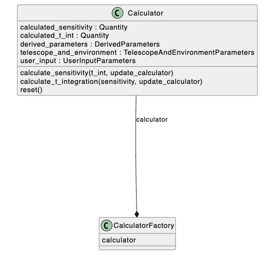
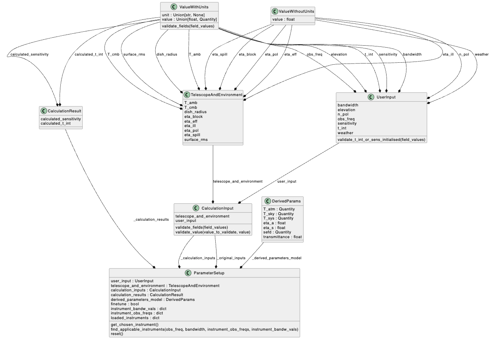

Application overview
====================
The sensitivity calculator consists of a Python package and a web application.
An overview of each component is provided below.

The calculator
--------------

The ``atlast_sc`` Python package contains the code that performs the sensitivity and
integration time calculations, configures
default and allowed values and units for the parameters used by the calculator,
and performs validation on data provided to the calculator. It
also provides utility tools for reading input data from a file and writing output
to file.

Information on using the Python package is provided :doc:`here <../user_guide/using_the_calculator>`.

Modules
^^^^^^^
Below is an overview description of each of the modules included in the
``atlast_sc`` package. More detailed information is provided in the
:doc:`Public API <../code_docs/public_api>` and :doc:`UML diagrams <../code_docs/uml>`
sections.

calculator_factory
++++++++++++++++++
This module creates a calculator instance according to user input that has been specified. 

calculator
++++++++++
This module contains the main ``Calculator`` class that provides the interface
for performing sensitivity and integration time calculations. A ``Calculator``
object may be instantiated with default parameter setup object, or by passing
user input parameters as arguments to the parameter setup object constructor.

This module provides methods exclusively for calculating sensitivity and integration time.
It retrieves parameter sets —including user inputs, telescope and environmental 
conditions, and derived parameters— through the parameter setup object. This design 
simplifies the process for users by providing a unified interface to access information 
from each parameter class.

parameter_setup
+++++++++++++++
This class serves as a centralised container for all parameter classes. When a parameter is 
updates in its respective class, the new value is can be retrieved through this class. It 
provides access to all models used in calculations and methods for operations related to 
identifying applicable instruments. The class also stores a copy of the
parameters used to initialize the calculator, allowing the user to revert to
the initial state.

data
++++
The ``Data`` class stores all of the configuration information for each of the user input, 
telescope and environment parameters used by the calculator (default values, default units, etc.), 
and calculated parameters.

The ``Validator`` class provides methods for validating data provided to the calculator.

models
++++++
This module contains model definitions that describe the structure of the data
provided to the calculator. The module uses the ``pydantic`` library; models
within the module inherit from the pydantic ``BaseModel``. Custom validation methods
within the models ensure that input data is of the right type and satisfies the
constraints defined in the ``data.Data`` class.

derived_groups
++++++++++++++
This module contains classes that logically group derived parameters used by
the calculator. Derived parameters are those that are dependent on the data
provided to the calculator (user input and telescope and environment). They are 
calculated at runtime when the calculator is instantiated, and when any of the 
independent parameters are updated.

The derived group classes are ``AtmosphereParams``, ``Efficiencies``, and
``Temperatures``. Although these classes are accessible via the public API, they
are primarily intended to be used internal to the calculator.

exceptions
++++++++++
This module contains the data validation exception and warning classes.

utils
+++++
This is a utility module that contains classes and methods used throughout the application.

Class Structure
^^^^^^^
General class structure can be visualised with the UML diagrams below. 

    

The web application
-------------------
The web client consists of a backend based on the `FastAPI web framework <https://fastapi.tiangolo.com/lo/>`__,
a standard, browser-based HTML/CSS/JavaScript frontend, and a REST API.

The FastAPI application renders the frontend using
the `Jinja templating engine <https://jinja.palletsprojects.com/en/3.1.x/>`__.

FastAPI also auto-generates an OpenAPI schema that can be used to render interactive,
browser-based documentation of the REST API. The documentation can be accessed via the following two URLs:

- ``<app_url>/docs`` to render with Swagger UI
- ``<app_url>/redoc`` to render with Redoc

where ``<app_url>`` is the root URL of the application (e.g., ``localhost:8000``).