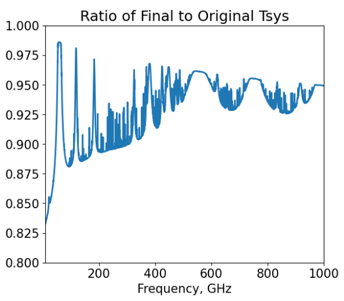

What's new in version 2
=======================

The AtLAST Sensitivity Calculator was first developed as part of the AtLAST Design Study (funded by the European Union's Horizon Europe research and innovation programme under grant agreement No. 951815). As part of the AtLAST2 Design Consolidation Phase (funded by the European Union's Horizon Europe research and innovation programme under grant agreement No. 101188037), a new version of the code has been developed. The key objective of this new version is to provide a calculator that takes into account the variety of instruments that are being developed for current (sub-)mm telescopes so that science users can better constrain their science cases.

Code refactor
+++++++++++++
The codebase has been refactored to have a more modular structure for the calculation process. In the
previous version, the code was structured in a singular streamlined process that made it difficult
to modify the calculation process. The new structure allows for better organisation of the
code and makes it easier to add new instruments or to modify the calculation process in the
future. These changes include separating the calculation input parameters into different classes 
based on their category, and introducing instrument modules where instrument data and methods are 
stored (see :ref:`Class Structure <class structure>` for a high level view of the new structure).

.. note::

    Users should note that this change has resulted in some backwards incompatible changes and so anyone who has code that used the previous version will likely need to update some of their commands. The changes needed are detailed here.

    The parameters are now stored in the classes ``user_input``, ``telescope_and_environment`` and ``derived_parameters``. For instance, in version 1, a user input parameter could be changed by calling:

    .. code-block:: python

        calculator.bandwidth = 50*u.GHz

    whereas in version 2 this now needs to be:

    .. code-block:: python

        calculator.user_input.bandwidth = 50*u.GHz   

    The way in which the current parameters can be displayed has also changed. Previously it was necessary to use ``print()``:

    .. code-block:: python

        print(calculator.user_input)
        print(calculator.instrument_setup)
        print(calculator.derived_parameters)

    Now there is a .show() method for each of these classes:
    
    .. code-block:: python

        calculator.user_input.show()
        calculator.telescope_and_environment.show()
        calculator.derived_parameters.show()

New instruments
+++++++++++++++
Version 1 of the calculator assumed a generic coherent receiver. In this new version, we have worked with builders of (sub-)mm instruments to understand how to represent their instruments in the code so that they can be used as examples of the different types of instrument that will be built for AtLAST. These instruments include high resolution heterodyne spectrometers, a continuum camera using Kinetic Inductance Detector technology and a Integrated Field Unit using Kinetic Inductance Detector technology. For more details on these instruments see :doc:`the instrument overview <../calculator_info/instrument_overview>`. For information on how to make use of these in the command line interface see :ref:`the instrument selection <section_instrument_selection>` section. The web client also now includes an instrument selection box to allow the user access to the different instruments. The code has now been designed to make it possible to add further instruments, which can be achieved by following the instructions on :doc:`adding a new instrument <../developer_guide/adding_new_instrument>`. The generic receiver used in version 1 can still be accessed by selecting the instrument labelled 'Default'. However, note that this will not provide exactly the same results as before as improvements have been made to the treatment of temperatures in the code, as detailed in the next section.

Changes to the treatment of temperatures
++++++++++++++++++++++++++++++++++++++++
During the process of working with the instrument builders to understand their instruments, we discovered that there were a few issues with the equations for the system temperature, which required the following changes:

* The contribution from the cosmic microwave background (CMB) was being counted twice as it was included in the output from the *am* code and also again in our equation for the sky temperature. We changed this so that it is only included in the sky temperature equation and not in the *am* code output.
* The CMB temperature was not being multiplied by the transmittance. This factor has now been added.
* All of the temperatures that contribute to the noise should be Rayleigh-Jeans brightness temperatures, as described in, e.g., section 13.2.1 of Interferometry and Synthesis in Radio Astronomy. This was not the case and so we have changed the *am* code output to ensure that our atmospheric temperature is a Rayleigh-Jeans brightness temperature and adapted our CMB temperature and ambient temperature using equation 10 from ALMA memo 602. Note that the receiver temperature remains unchanged as this is defined as a Rayleigh-Jeans brightness temperature.

The following plot shows the ratio between the final system temperature after taking into account these changes compared to the original system temperature from version 1 of the code.

Miscellaneous changes
+++++++++++++++++++++
A number of other miscellaneous changes have also been made including:

* Update and expansion of the documentation
* Update and expansion of test utilities
* More explanatory exception messages